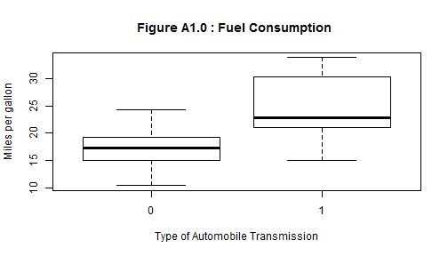
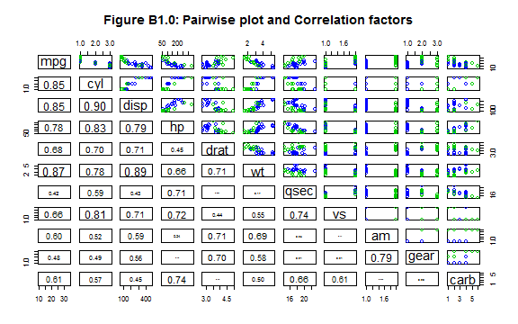
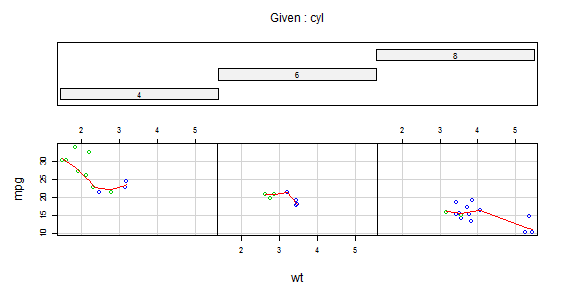
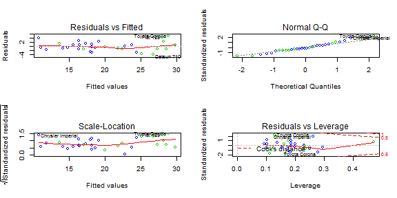

## Difference in fuel consumption between automatic and manual transmission automobiles 
### Summary
The purpose of this study is use linear regression to explore the relationship between fuel consumption, expressed in miles per gallon (mpg), and 10 other automobile design and performance aspects(features) for 32 automobiles 
manufactured in the years 1973 and 1974. The design  features include the transmission (manual or automatic) of the automobile, the number of engine cylinders, its weight, rear axle ratio, number of foward gears, number of carburators and displacement ratio. The performance features include the fuel consumption, the gross horse power and the quarter-mile time. 

### Data
The *mtcars* dataset was used in the study, and is available in the R library. The R commands in Appendix A: can be used to load the mtcars and display the first three(3) observations in the dataset. All variables are recorded as numeric values. For this analysis some of the variables will be used a categorical(factor) variables.

### Exploratory Analysis
The dataset contains 19 automatic and 13 manual transmission automobiles.Figure A1.0 in appendix A: shows that the average fuel consumption for automatic transmission automobiles appears to be  higher (17.1 miles per gallon) compared to the manual transmission automobiles (24.4 miles per gallon) . 
Appendix **Figure B1.0:** shows pairwise plot and the correlation factors between all the variables in the dataset. It should be noted that the pairwise plot also shows that colinearity between the predictor variables. Some of the correlations, for example betweem fuel consumption and engine horse power (R=0.78), appear to be non-linear.

### Linear Regression Model
### Initial model
Using R commands shown in Appendix C: we can build a linear model that expressses the relationship between the miles per gallon and the other disign and performance aspects of an automobile. The initial model includes all the variables, and using a 5% significance level, we observe from the summary that some of the variables have  p-values greater than 5% and could potentially be removed from the model. 
### Best Model Selection Strategy
Using a backward selection stratergy, we can build a more parsimonious model (refer to code in Appendix C:) than the model obtained in the previous section.
A summary of the model parameters is shown in **Appendix C:** . Based on the model, the relationship between the fuel consumption, in miles per gallon (mpg), and the predictor variables (**cyl,hp, wt**, and **am**) can be epressed using the following linear regression function:

*mpg = 33.71 - 3.03cyl6 -2.16cyl8 - 0.03hp -2.50wt + 1.81am1*

### Interpretation of the Regression Model
All other factors held constant and on average, we observe that the predicts a reduction of only 0.03 miles per gallon for every unit increase in engine horse power. In terms of the number of cylinders, the model predicts that the miles per gallon (mpg) for 6 cylinder engine automobiles is 3.03 miles per gallon lower, on average, than 4 cylinder engine automobiles. Similary, the model predicts that the miles per gallon (mpg) for 6 cylinder engine automobiles is 2.16 miles per gallon lower, on average, than 4 cylinder engine automobiles. The difference between the 6 and 8 cylinder engines is 0.87 miles per gallon, and this can be interpreted to mean that on average 6 cylinder engine automobiles travel 0.87 more miles per gallon than 8 cylinder engines.Furthermore, the model predicts that the miles per gallon decreases by 2.5 miles for each unit increase in weight. 

Finally, In terms of type of engine transmission (automatic or manual), the model predicts that all things held constant, the miles per gallon (mpg) for manual transmission automobiles is 1.81 higher, on average, than automatic transmission engine automobiles.  Appendix D: shows the model data in a conditional plot, and  We observe that the interpretation provided above is to a large extent consistant with data shown on the conditional plot.  

### Diagnostics

**Appendix E:** shows some of the diagnostic plot for the fitted model. The residuals plot shows  relatively constant variability of the residuals against the fitted values with a few outliers. The quantile plot also shows normal errors with a bit of skew around the outlying points.
### Conclusion

The data provides evidence that automatic transmission automobile consume more gallons of fuel per mile compared to manual transmission engines. However the data may be biased since we observe from the plot in Appendix C: that the majority (63%) of the automatic automobiles in the dataset use 8 cylinder engines which, according to the model, tend to weigh more and hence consume for fuel.


## APPENDIX

### Appendix A:

The R code for loading dataset and displaying first three(3) observations:

```r
data(mtcars)
head(mtcars, 3)
```

```
##                mpg cyl disp  hp drat    wt  qsec vs am gear carb
## Mazda RX4     21.0   6  160 110 3.90 2.620 16.46  0  1    4    4
## Mazda RX4 Wag 21.0   6  160 110 3.90 2.875 17.02  0  1    4    4
## Datsun 710    22.8   4  108  93 3.85 2.320 18.61  1  1    4    1
```


 


### Appendix B:
A paiwise plot for the provided data. The **blue** points correspond to automatic transmission automobiles and the **green** points correspond to manual transmission automobiles.

 


### Appendix C:


Initial model: **model1** 

```r
model1 <- lm(mpg ~ ., data = mtcars)  # initial model including all variables
## summary(model1) -- commented out to reduce number of pages coef(model1) --
## -- commented out to reduce number of pages
```


Best fit model: **model2**


```r
library(MASS)
model2 <- stepAIC(model1, method = "backward")  # iterative results too long; not echoed
## summary(model2)-- commented out to reduce number of pages
```


```r
coef(model2)
```

```
## (Intercept)        cyl6        cyl8          hp          wt         am1 
##    33.70832    -3.03134    -2.16368    -0.03211    -2.49683     1.80921
```


### Appendix D:
A conditional plot of the miles per gallon (mpg) against the weight(wt) and conditioned on number of cylinders (cyl). The **blue** points correspond to automatic transmission automobiles and the **green** points correspond to manual transmission automobiles.  


```r
require(graphics)
coplot(mpg ~ wt | cyl, data = mtcars, panel = panel.smooth, rows = 1, col = 3 + 
    (mtcars$am == 0), main = "Figure C1.0")
```

 


## Appendix E:

```r
par(mfrow = c(2, 2))
plot(model2, col = 3 + (mtcars$am == 0))
```

 


